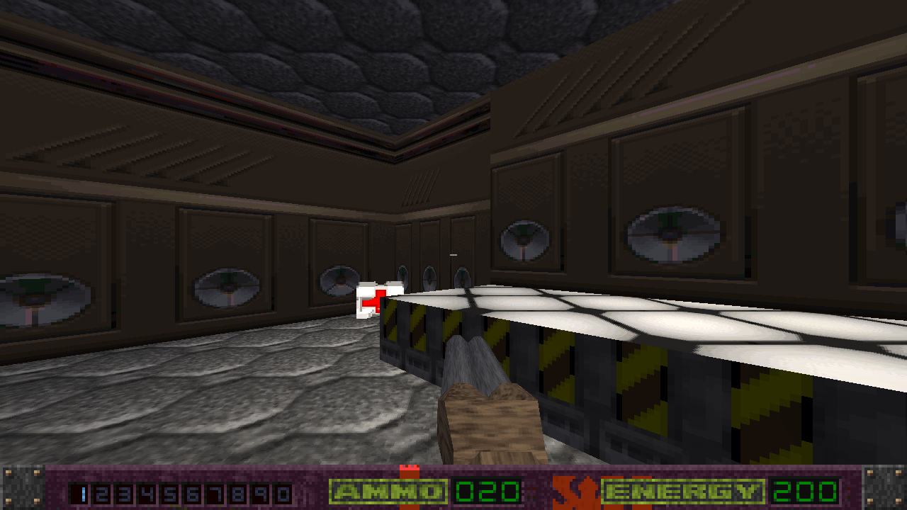
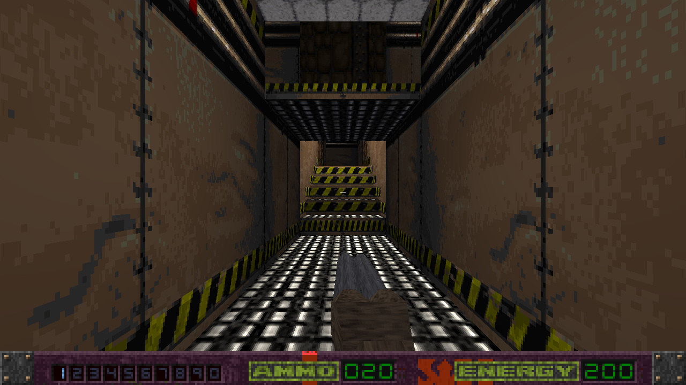

# AB3D2 Rebirth — le remake full 3D

Remake **full 3D** d'*Alien Breed 3D II : The Killing Grounds* (Team17, Amiga, 1996) sur
**jMonkeyEngine 3**, à partir du portage Java fidèle du moteur d'origine.

> ⚠️ **Chantier en cours**, pas une version jouable de bout en bout.



*Le niveau A. Même simulation que le portage d'origine, éclairage par lampes, ombres portées,
visée verticale réelle.*

---

## Le principe

Ce projet n'est pas un portage de plus : c'est un **autre moteur**. Il ne rejoue pas le
rasteriseur d'origine, il reconstruit les niveaux en vraie 3D et rejoue la même logique de jeu.

- **Le portage (`../java`) est l'oracle.** Il est compilé avec ce projet
  (`srcDirs = ['src', '../java/src']`) et sert de **lecteur autoritatif** des formats d'origine
  pour l'extraction des assets. Quand une règle de jeu est douteuse, c'est contre lui qu'on
  tranche ; au besoin on remonte à l'assembleur (`../../ab3d2-tkg/ab3d2_source`).
  **On ne modifie jamais son code.**
- **Le maximum d'outils jME.** Matériaux en `.j3m`, scènes en `.j3o`, shaders dans `assets/` :
  tout ce que le jeu affiche doit pouvoir s'ouvrir et se corriger à la main, ou dans le SDK jME,
  sans recompiler.
- **jME ouvre la voie Android**, qui est l'une des raisons du choix du moteur.

---

## Les assets : tout est régénérable

**Aucune donnée du jeu n'est versionnée.** Seuls les shaders, qui sont à nous, le sont. Tout le
reste se reconstruit depuis les cinq disquettes (cf. le portage pour leur récupération) :

```bash
gradle -p rebirth extract      # assets d'origine  -> PNG / JSON / OBJ / WAV
gradle -p rebirth materials    # matériaux          -> assets/materials/*.j3m
gradle -p rebirth scenes       # niveaux            -> assets/Scenes/*.j3o
```

| | format | modifiable à la main |
| --- | --- | --- |
| textures, sprites | PNG | ✅ |
| sons, musiques | WAV | ✅ |
| matériaux (murs, sols) | **`.j3m`** | ✅ |
| niveaux | **`.j3o`** | ✅ |
| shaders | GLSL + `.j3md` | ✅ (versionnés) |
| modèles vectoriels | OBJ + sidecar `.lvl` | ⚠️ voir ci-dessous |

Les **modèles vectoriels** restent en OBJ : chaque face porte ses données d'éclairage
directionnel (`frame_NNN.lvl`, niveau de base + secteur d'angle) et le maillage est *régénéré
quand la lumière change*. Un `.j3o` figé casserait cet éclairage.

Leur **échelle** vient de l'assembleur, pas de l'œil. Un point de modèle et la position de
l'objet qui le porte se rencontrent dans le même accumulateur juste avant la division
perspective : le rapport de leurs deux facteurs donne l'échelle exacte, sans dépendre de la
projection. Il vaut 1/4 de mot de niveau sur les trois axes, soit **1 unité d'OBJ = 1 unité
monde**. La valeur réglée à vue qui précédait (0,75) faisait des modèles de moitié trop gros :
un fusil à pompe de 1,86 unité de long alors que l'œil du joueur est à 1,70. Seule l'arme en
main y échappe — l'original force sa profondeur à 1 (`DRAW_VECTOR_NEAR_PLANE`), sa taille à
l'écran ne vient donc pas du monde et garde son propre facteur.

### Deux pièges du `.j3m`

- **`Repeat` est indispensable.** Sans lui les murs perdent leur motif et le bord de l'image
  s'étire en traînées verticales.
- **Le filtrage ne s'exprime pas en `.j3m`.** `LevelBuilder.pixelate()` repose « plus proche
  voisin » après chargement — y compris sur les matériaux qui reviennent dans une scène `.j3o`,
  sans quoi jME interpole et les textures de 1996 deviennent floues.

---


*Le menu d'origine — fond qui défile, texte qui brûle — reporté à l'identique. Le feu est un
portage littéral des trois blits Amiga `D = A_décalé | (B & C)`, où `A` est un plan de la police :
c'est le texte lui-même qui alimente les flammes.*

---

## Les scènes `.j3o`

Le jeu **charge** `assets/Scenes/level_<x>.j3o` quand il existe : corriger un mur dans le SDK se
voit en jeu. `-Pnolevelscene` force l'ancien chemin (reconstruction depuis le JSON), ce qui
permet de comparer les deux à tout moment — ils sont **identiques au pixel près**.

La scène ne contient que le **décor**. Les objets (ramassages, décor animé, monstres) sont des
entités que le jeu place et retire en cours de partie : les figer n'aurait pas de sens.

Les parties **mobiles** du décor sont ré-attachées **par nom de nœud** après chargement :

| nœud | rôle |
| --- | --- |
| `lift_zone_<id>` | sol d'ascenseur |
| `door_zone_<id>` | plafond de zone-porte (le dessous du battant) |
| `deform_<n>_<clé>` | groupe de murs que la porte/l'ascenseur `<n>` déforme |
| `water_<id>` | surface d'eau |
| `flat_tile<n>`, `wall_<clé>` | décor statique |



*Niveau C, zone 117. Le jeu empile deux planchers dans un même secteur : une zone porte **deux**
flux de géométrie. L'extraction n'en lisait qu'un et tout l'étage supérieur manquait — ici la
passerelle au-dessus de l'escalier.*

---

## L'éclairage

Une lumière par zone, toutes attachées à la racine. On n'allume que les zones **potentiellement
visibles** depuis celle du joueur — le PVS du jeu d'origine, qu'on extrait avec le reste :

| niveau | lumières | allumées |
| --- | --- | --- |
| A | 134 | 11 |
| C | 199 | 14 |
| O | 166 | 37 |

**Écarter une lumière, c'est annuler son RAYON, pas sa couleur.** jME filtre les lumières en
testant leur rayon contre le volume englobant de chaque géométrie (`DefaultLightFilter`) : une
lumière noire mais de grand rayon reste dans le lot et coûte toujours sa passe. La première
version de ce tri éteignait la couleur et ne gagnait donc **rien** — les compteurs du moteur
donnaient le même nombre de soumissions avec et sans.

Mesuré, VSync coupée, trois tirs par cas (`-PfpsLog -Pnovsync`, contre `-PnoPvsLights`) :

| niveau | sans tri | avec tri | soumissions |
| --- | --- | --- | --- |
| A | 175-178 img/s | **231-233** | 306 → 157 |
| C | 306-322 img/s | **360-406** | 135 → 74 |
| O | 102-111 img/s | **147-150** | 718 → 580 |

Soit 20 à 38 %, et environ moitié moins d'appels de dessin.

Ce qui coûte dans ce moteur, ce sont les **soumissions**, pas l'ombrage : `-Pfullbright` ne gagne
que 2 %, `-Pnoshadow` 9 %. Et agrandir le paquet de lumières est contre-productif — `lightBatch=8`
descend à 456 soumissions mais tombe à 105 img/s, `16` à 349 et 92 img/s, chaque passe évaluant
alors plus de lumières par fragment. Le défaut de **4** est le bon.

Invisible à l'image (vérifié) : une lumière hors PVS n'éclairait rien de ce qu'on voit.

---

## Lancer

```bash
gradle -p rebirth run                 # le jeu
gradle -p rebirth run -Plevel=c       # un autre niveau
gradle -p rebirth moveTest shotTest alienTest [-Plevel=c]   # simulation, headless
gradle -p rebirth menuTest            # le menu
```

Quelques options utiles : `-Pnolevelscene` (rebâtir au lieu de charger la scène), `-Pretro`
(émulation du rasteriseur d'origine), `-Pfullbright`, `-PlightLog`, `-PdeformLog`,
`-Pshot=N` (capture après N frames), `-Pnosound`.

Pour mesurer : `-PfpsLog` imprime le temps de frame moyen, `-Pnovsync` lève le plafond du
rafraîchissement (sans elle toute mesure donne 60 et ne veut rien dire), `-PnoPvsLights` rallume
toutes les lumières pour servir de référence.

## Ouvrir dans le SDK jME

Le dossier est un projet jME (`nbproject/`, calqué sur le gabarit officiel du SDK). Gradle reste
le build de référence ; le build Ant écrit dans `build-nb/` pour ne pas marcher dessus.

---

*Alien Breed 3D II : The Killing Grounds* et ses données sont la propriété de **Team17**. Projet
non commercial, à but d'étude et de préservation.
